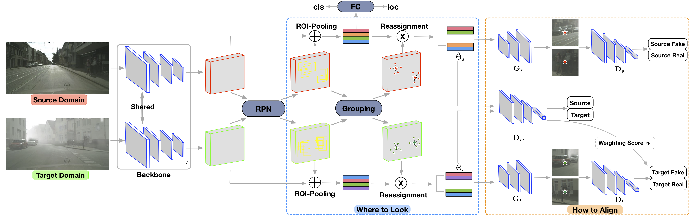

# SCDA

 The project of our work **"Adapting Object Detectors via Selective Cross-Domain Alignment" (CVPR2019)**




## Quick View
Quick view about the paper can be found in this [slide](https://drive.google.com/open?id=1P7gf9dicO1K07l-btBRgG3hZM9ofl0kC)

## Installation
#### Requirements
- PyTorch 0.4.1 (also test with 0.4.0)
- torchvision 0.2.1
- OpenCV
- scikit-learn
- Cython
- GCC >= 4.9 (test with 5.4)

#### Install
1. cd extensions; ./build_all.sh
2. cd datasets/pycocotools & make  (install pycocotools according to the guideline)

## Data Preparation
Download the cityscapes and foggy-cityscapes datasets from [cityscapes](https://www.cityscapes-dataset.com/downloads/).

We provide the meta-files for training and validation, and you can find them in this [url](https://drive.google.com/open?id=1Cv6pLJh0E5elvhhTcXaH6eZXDvN8KfEX). It consists of train.txt, foggy_train.txt and foggy_val.txt. If you want to train with your own datasets, please custom these meta-files with your setting.

## Training
We provide several training scripts for our three-types models. Following with the MMDetection, we use the slurm for distributed training (details can be found [here](https://github.com/open-mmlab/mmdetection/blob/master/tools/slurm_train.sh)). 

1. you need to modify hyper-parameters in these bash scripts (./example/faster-rcnn/cityscapes/vgg/); For example, train_meta_file, target_meta_file and val_meta_file, etc.
You also need to download these image-net pretrained models, such as vgg16.
2. the hyper-parameters of detection are placed in config_512.json, and you can custom them.
3. training:
```bash
cd ./example/faster-rcnn/cityscapes/vgg/
sh 4cluster.sh # for our type-2

# Details (we follow the slurm training in MMDetection); 
# For the detailed descriptions of these hyperparameters, please refer to the ./tools/faster_rcnn_train_val.py

#!/bin/bash
ROOT=../../../..
export PYTHONPATH=$ROOT:$PYTHONPATH
#--------------------------
job_name=training_4cluster
ckdir=4cluster
mkdir ./${ckdir}/${job_name}
#--------------------------
PARTITION=$1
GPUS=${5:-8}
GPUS_PER_NODE=${GPUS_PER_NODE:-8}

srun -p ${PARTITION} --ntasks=${GPUS} --gres=gpu:${GPUS_PER_NODE} \
		--ntasks-per-node=${GPUS_PER_NODE} \
    --job-name=${job_name} \
python -u -W ignore $ROOT/tools/faster_rcnn_train_val.py \
  --config=config_512.json \
  --dist=1 \
  --fix_num=0 \
  --L1=1 \
  --cluster_num=4 \
  --threshold=128 \
  --recon_size=256 \
  --port=21603 \
  --arch=vgg16_FasterRCNN \
  --warmup_epochs=1 \
  --lr=0.0000125 \
  --step_epochs=16,22 \
  --batch-size=1 \
  --epochs=25 \
  --dataset=cityscapes \
  --train_meta_file=/path/to/train.txt \
  --target_meta_file=/path/to/foggy_train.txt \
  --val_meta_file=/path/to/foggy_val.txt \
  --datadir=/path/to/leftImg8bit/ \
  --pretrained=/path/to/torchvision_models/vgg16-397923af.pth \
  --results_dir=${ckdir}/${job_name}/results_dir \
  --save_dir=${ckdir}/${job_name} \
  2>&1 | tee ${ckdir}/${job_name}/train.log

```


## Evaluation
We provide our pre-trained model in this [url](https://drive.google.com/open?id=1FlQePvlavZVgmzBik6IdcG_xWh0xtROz). You can download it and make a test (please modify these parameters before evaluation).

We support slurm evaluation and single-gpu evaluation. Please check the eval.sh and eval_single.sh
```bash
sh eval_single.sh # evaluation with single gpu ==> mAP:33.91
```

## Citation
If you find our work useful in your research, please consider citing our paper:
```
@inproceedings{zhu2019adapting,
  title={Adapting Object Detectors via Selective Cross-Domain Alignment},
  author={Zhu, Xinge and Pang, Jiangmiao and Yang, Ceyuan and Shi, Jianping and Lin, Dahua},
  booktitle={Proceedings of the IEEE Conference on Computer Vision and Pattern Recognition},
  pages={687--696},
  year={2019}
}
```

## Acknowledgments
We thanks for the opensource codebases, [mmdetetion](https://github.com/open-mmlab/mmdetection) and [Detectron.pytorch](https://github.com/roytseng-tw/Detectron.pytorch).

